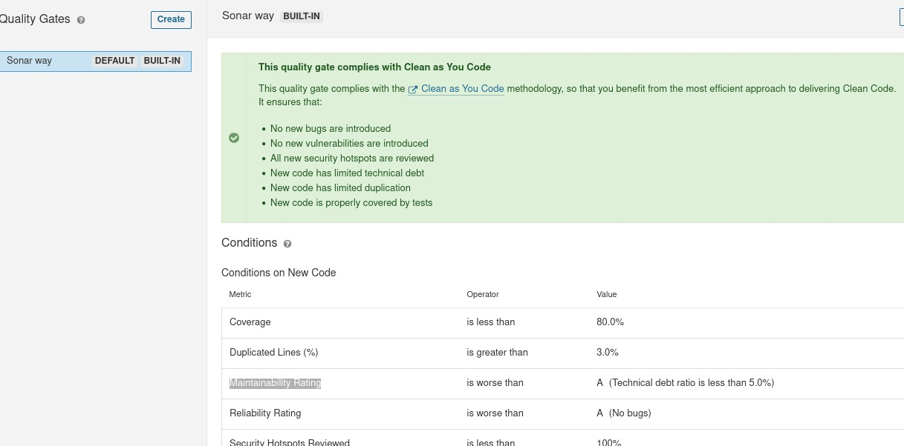

# Fast Tasker


## Team members
- Coloma Yujra, Riki Santher
- Rivera Torres, Jose Alberto
- Miramira Bellido, Rimsky Augusto
- Montañez Pacco, Roni Ezequiel

## 📑 Table of Contents

* [📖 Overview](#-overview)
* [🎯 Project Purpose](#project-purpose)
* [🧬 Domain Model](#domain-model)
* [🏗 Architecture](#-architecture)
    * [📦 Services and Components](#-services-and-components)
* [🛣️ REST API Endpoints](#️-rest-api-endpoints)
* [🔄 CI/CD Pipeline](#-cicd-pipeline)
* [🚀 Prerequisites](#-prerequisites)
* [🛠️ Installation and Setup](#️-installation-and-setup)
    * [1. Clone the repository](#1-clone-the-repository)
    * [2. Environment Variables Configuration](#2-environment-variables-configuration)
    * [3. Running with Docker Compose](#3-running-with-docker-compose)
    * [4. Service Access](#4-service-access)
* [💻 Developer Guide (Manual Build)](#-developer-guide-manual-build)
    * [1. Install Common Library](#1-install-common-library)
    * [2. Run Monolith App](#2-run-monolith-app)
    * [3. Run Notification Service](#3-run-notification-service)

## 📖 Overview

This project is a system for a task management application, designed with a microservices architecture.

This project is the result of migrating a monolithic system to a **Microservices** architecture. The ecosystem is designed following **Domain-Driven Design (DDD)** and **Clean Architecture** principles to ensure scalability, maintainability, and decoupling.

## Project Purpose
**Fast Tasker** is a service marketplace platform inspired by *Airtasker*. It connects users who need tasks done (**Posters**) with skilled individuals ready to do them (**Taskers**). The system facilitates the entire flow: from posting tasks and negotiating via offers, to real-time communication and reputation management.

## Domain Model


## 🏗 Architecture

The system uses a distributed architecture orchestrated via Docker Compose. Each microservice internally follows a **Hexagonal Architecture (Ports and Adapters)** divided into layers:

- **Domain:** Entities and business rules (pure core).
- **Application:** Use cases.
- **Infrastructure:** Persistence, external clients, messaging.
- **Interface (API):** REST Controllers.

### 📦 Services and Components

| Service | Docker Profile | Local Port | Description |
| :--- | :--- | :--- | :--- |
| **API Gateway** | `default` | `8081` | Single entry point for the client. Routes requests to the corresponding microservices. |
| **Monolith App** | `default` | `8082` | Main service managing tasks, users, and conversations. Contains the core business logic. |
| **Notification Service** | `default` | `8083` | Microservice responsible for managing and sending real-time notifications via WebSockets and RabbitMQ. |
| **Common** | `N/A` | `N/A` | Shared library containing common configurations (JWT security, RabbitMQ), base DTOs, utilities, and global exceptions. |
| **Docker Init** | `default` | `N/A` | Scripts for PostgreSQL database initialization. |
| **RabbitMQ** | `default` | `5672` (AMQP), `15672` (UI) | Message broker for asynchronous communication. |
| **PostgreSQL** | `default` | `5433` | Relational database. |
| **Jenkins** | `ops` | `8080` | Automation server for CI/CD. |
| **SonarQube** | `ops` | `9000` | Platform for code quality and security analysis. |
| **Client (Next.js)** | `frontend` | `3000` | Frontend client application. |

## 🛣️ REST API Endpoints
Below are the available operations per module.

### 🔐 Module: Auth (Authentication)
*Access management and base account registration.*

| Method | URL | Description | Parameters / Body |
| :--- | :--- | :--- | :--- |
| `POST` | `/api/v1/auth/register` | Register new account | `RegisterAccountRequest` |
| `POST` | `/api/v1/auth/login` | Login | `LoginRequest` |

### 📋 Module: Task (Tasks & Offers)
*Marketplace core: task lifecycle management.*

| Method | URL | Description | Parameters / Body |
| :--- | :--- | :--- | :--- |
| `POST` | `/api/v1/tasks` | Post a new task | `TaskRequest` |
| `GET` | `/api/v1/tasks` | List active public tasks | - |
| `GET` | `/api/v1/tasks/my-tasks` | List my posted tasks | *(Token)* |
| `GET` | `/api/v1/tasks/{taskId}` | Get full task details | `taskId` |
| `POST` | `/api/v1/tasks/{taskId}/offers` | Send an offer for a task | `OfferRequest` |
| `GET` | `/api/v1/tasks/{taskId}/offers` | List received offers | `taskId` |
| `POST` | `/api/v1/tasks/{taskId}/questions` | Post a question | `QuestionRequest` |
| `GET` | `/api/v1/tasks/{taskId}/questions` | List questions | `taskId` |
| `POST` | `/api/v1/tasks/{taskId}/answer` | Answer a question | `AnswerRequest` |

### 💬 Module: Chat (Conversations)
*Private messaging and real-time system.*

| Method | URL | Description | Parameters / Body |
| :--- | :--- | :--- | :--- |
| `GET` | `/api/v1/conversations/inbox` | Get inbox | *(Token)* |
| `POST` | `/api/v1/conversations/start` | Start/Resume chat | `StartChatRequest` |
| `GET` | `/api/v1/conversations/{id}/messages`| Get message history | `conversationId` |
| `WS` | `/chat/.send` | Send message (WebSocket) | `MessageRequest` |

### 👤 Module: Tasker (Profile)
*Professional profile management.*

| Method | URL | Description | Parameters / Body |
| :--- | :--- | :--- | :--- |
| `PUT` | `/api/v1/tasker/register` | Create/Update Tasker profile | `TaskerRequest` |
| `GET` | `/api/v1/tasker/user/{userId}` | Get public profile | `userId` |
| `GET` | `/api/v1/tasker/user/me` | Get my profile | *(Token)* |
| `PUT` | `/api/v1/tasker/assign-tasker` | Assign task winner | `AssignTaskerRequest` |

### 🔔 Module: Notification
*Dedicated notification microservice.*

| Method | URL | Description | Parameters / Body |
| :--- | :--- | :--- | :--- |
| `POST` | `/api/v1/notifications` | Send notification (System) | `NotificationRequest` |
| `GET` | `/api/v1/notifications` | Get my notifications | *(Token)* |


## 🔄 CI/CD Pipeline

The project features a continuous integration pipeline defined in `Jenkinsfile` that automates the following stages:

1.  **Setup Code:** Environment cleanup and source code download.
2.  **CI Flow (Develop):** Runs on the `develop` branch or Pull Requests targeting it.
    *   **Parallel Analysis:** Build and static analysis with **SonarQube** for Monolith and Notification Service in parallel.
    *   **Quality Gate:** Waits for SonarQube Quality Gate approval.
3.  **Staging Checks:** Runs on Pull Requests targeting `staging`.
    *   **Security Scan:** Vulnerability analysis (SAST/DAST).
    *   **Performance Tests:** Load and performance testing.

### - Static Analysis
```groovy
  steps {
        cleanWs()
        unstash 'source-code' 
        // build and install 'common' project
        dir('common') {
            sh 'mvn clean install -DskipTests'
        }
        dir('monolith-app') {
            sh 'rm -rf .scannerwork target'
            withSonarQubeEnv('sonar-server') {
                withCredentials([file(credentialsId: 'fast-tasker-env', variable: 'ENV_FILE')]) {
                    sh '''
                        cp $ENV_FILE .env 
                        sed -i 's/\r$//' .env
                        set -a 
                        . ./.env
                        set +a
                        mvn clean verify org.sonarsource.scanner.maven:sonar-maven-plugin:sonar \
                            -Dsonar.projectKey=fast-tasker-monolith \
                            -Dsonar.projectName="Fast Tasker Monolith" \
                            -Dsonar.ws.timeout=300
                    '''
                }
            }
```
### - Unit Testing

```groovy
            dir('notification-service') {
                sh 'rm -rf .scannerwork target'
                withSonarQubeEnv('sonar-server') {
                    withCredentials([file(credentialsId: 'fast-tasker-env', variable: 'ENV_FILE')]) {
                        sh '''
                            cp $ENV_FILE .env
                            sed -i 's/\r$//' .env
                            set -a 
                            . ./.env
                            set +a
                            mvn clean verify org.sonarsource.scanner.maven:sonar-maven-plugin:sonar \
                                -Dsonar.projectKey=fast-tasker-notification \
                                -Dsonar.projectName="Notification Service" \
                                -Dsonar.ws.timeout=300
                        '''
                    }

                }
                // wait for qualitygate for notification service
                timeout(time: 10, unit: 'MINUTES') {
                    waitForQualityGate abortPipeline: true
                }
            }
```

```java

    @BeforeEach
    void setUp() {
        task = mock(Task.class);
    }

    @Nested
    @DisplayName("createTask()")
    class CreateTask {
        @Test
        @DisplayName("Saves task and returns response")
        void savesTaskWhenValid() {
            TaskRequest request = mock(TaskRequest.class);
            Task taskEntity = mock(Task.class);
            TaskResponse response = mock(TaskResponse.class);

            when(taskMapper.toTaskEntity(request, posterId)).thenReturn(taskEntity);
            when(taskRepository.save(taskEntity)).thenReturn(taskEntity);
            when(taskMapper.toResponse(taskEntity)).thenReturn(response);

            var result = taskService.createTask(request, posterId);

            assertThat(result).isEqualTo(response);
            verify(taskRepository).save(taskEntity);
        }
    }
```


### - Security Testing and Performance Testing

```groovy
         parallel {
                // security test
                stage('Security Scan (SAST/DAST)') {
                    when {
                        expression { return params.RUN_SECURITY }
                    }
                    agent any
                    steps {
                        cleanWs()
                        unstash 'source-code'
                        echo "--- RUN SECURITY TEST ---"
                        sh 'echo "Running Trivy or OWASP..."'
                    }
                }

                // performance test
                stage('Performance Tests') {
                    when {
                        expression { return params.RUN_PERFORMANCE }
                    }
                    agent any
                    environment {
                        SCRIPT_PATH = 'tests/performance/fasttasker2.jmx'
                        RESULT_PATH = 'tests/performance/result.jtl'
                        REPORT_DIR  = 'tests/performance/report-html'
                        
                        JMETER_VERSION = '5.6.3'
                    }
                    steps {
                        cleanWs()
                        unstash 'source-code'
                        
                        script {
                            // install jmeter
                            def jmeterDir = "/tmp/jmeter-${JMETER_VERSION}"
                            def jmeterBin = "${jmeterDir}/bin/jmeter"
                            
                            if (!fileExists(jmeterBin)) {
                                echo "Instalando JMeter en ${jmeterDir}..."
                                sh "mkdir -p ${jmeterDir}"
                                
                                // download jmeter
                                sh "curl -Lks https://archive.apache.org/dist/jmeter/binaries/apache-jmeter-${JMETER_VERSION}.tgz | tar -xz -C ${jmeterDir} --strip-components=1"
                                
                            } else {
                                echo "using jmeter in cache"
                            }
                            
                            // ejecute tests
                            
                            try {
                                sh """
                                    ${jmeterBin} -n \
                                    -t ${SCRIPT_PATH} \
                                    -Jhost=host.docker.internal \
                                    -l ${RESULT_PATH} \
                                    -e -o ${REPORT_DIR}
                                """
                            } catch (Exception e) {
                                echo "finish"
                            }
                        }
                    }
                    post {
                        always {
                            publishHTML target: [
                                allowMissing: false,
                                alwaysLinkToLastBuild: true,
                                keepAll: true,
                                reportDir: 'tests/performance/report-html',
                                reportFiles: 'index.html',
                                reportName: 'Reporte Performance'
                            ]
                        }
                    }
                }
            }
        }
```

## 🚀 Prerequisites

*   **Java JDK 21**
*   **Docker** & **Docker Compose**
*   **Maven**
*   **Git**

## 🛠️ Installation and Setup

Follow these steps to bring up the complete environment locally.

### 1. Clone the repository
```bash
git clone https://github.com/kimyork32/fast-tasker-backend.git
cd fast-tasker-backend
```

### 2. Environment Variables Configuration
Create a `.env` file in the project root. You can use the `.env.example` file as a reference for the necessary variables.

```bash
cp .env.example .env
```

Ensure you correctly configure credentials and ports before starting the services.

### 3. Running with Docker Compose

The project uses **Docker Compose Profiles** to manage service groups.

#### 🔹 Start Backend (Core Services)
Starts Database, RabbitMQ, API Gateway, Monolith, and Notification Service.
```bash
docker compose up -d
```
*If you only want to start the infrastructure (DB and RabbitMQ):*
```bash
docker compose up -d db rabbitmq
```

#### 🔹 Start Operations Tools (Jenkins, SonarQube)
To start the CI/CD and code analysis environment.
```bash
docker compose --profile ops up -d
```

#### 🔹 Start Frontend Client
To start the client application (Next.js).
```bash
docker compose --profile frontend up -d
```

#### 🔹 Stop All
To stop and remove containers, networks, and volumes for all profiles.
```bash
docker compose down -v
```

### 4. Service Access

| Service | Local URL | Credentials (Default) |
| :--- | :--- | :--- |
| **API Gateway** | `http://localhost:8081` | - |
| **RabbitMQ UI** | `http://localhost:15672` | `guest` / `guest` |
| **Jenkins** | `http://localhost:8080` | Configure on first launch |
| **SonarQube** | `http://localhost:9000` | `admin` / `admin` |
| **Client** | `http://localhost:3000` | - |

## 💻 Developer Guide (Manual Build)

If you need to manually build and run the services without Docker (e.g., for debugging or development), follow these steps.

**Note:** Ensure that the database and RabbitMQ are running (you can use `docker compose up -d db rabbitmq`).

### 1. Install Common Library
The `common` module is a dependency for other services. It must be installed in your local Maven repository first.

```bash
cd common
./mvnw clean install
cd ..
```

### 2. Run Monolith App
```bash
cd monolith-app
./mvnw spring-boot:run
```
*Or to build the JAR:*
```bash
./mvnw clean package
java -jar target/fast-tasker-0.0.1-SNAPSHOT.jar
```

### 3. Run Notification Service
```bash
cd notification-service
./mvnw spring-boot:run
```
*Or to build the JAR:*
```bash
./mvnw clean package
java -jar target/notification-service-0.0.1-SNAPSHOT.jar
```
